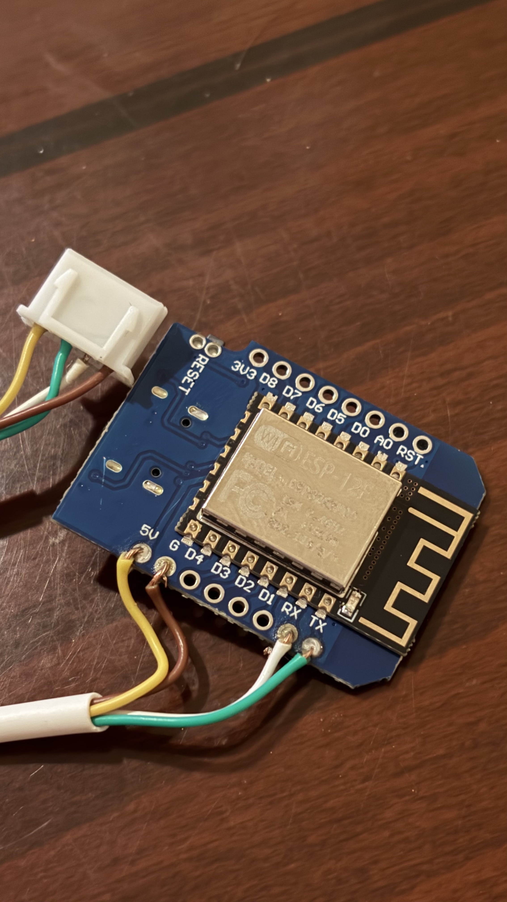
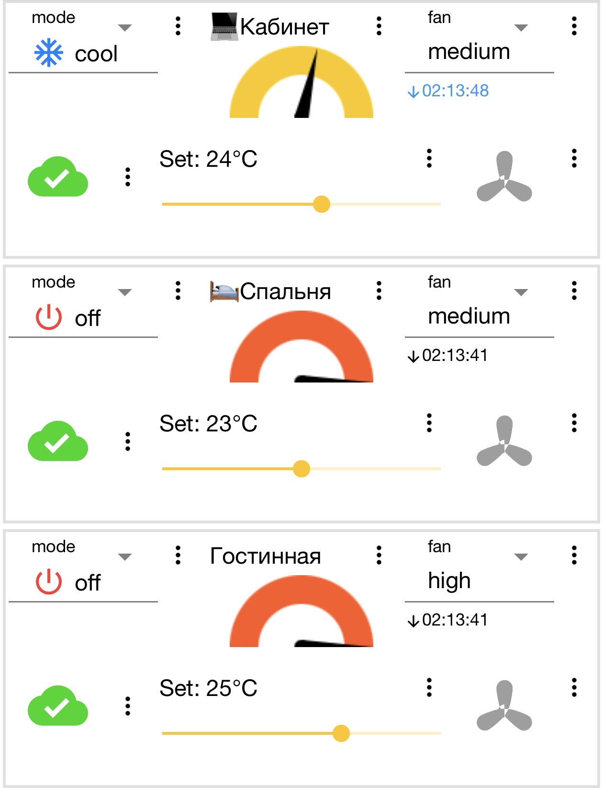

# esphome_gree_hvac-extended

Extended fork of [bekmansurov/esphome_gree_hvac](https://github.com/bekmansurov/esphome_gree_hvac) — an ESPHome component for GREE-based HVAC units (air conditioners made by Zhuhai Gree Group Co., Ltd.), talking to the AC over its internal UART control link.

All credit for the original protocol reverse-engineering and base component goes to [@bekmansurov](https://github.com/bekmansurov). This fork adds control of AC features the upstream component didn't expose yet.

## Disclaimer

This project is shared for educational/informational purposes, as-is, with no warranty of any kind. It is not affiliated with, endorsed by, or supported by Zhuhai Gree Group Co., Ltd. or any AC manufacturer. Using it means opening your AC, modifying its wiring, and running third-party firmware against a proprietary protocol that was reverse-engineered, not documented by the manufacturer.

**You use this entirely at your own risk.** The author(s) and contributors of this repository accept no responsibility or liability for any damage to your AC, your electrical system, your property, or any injury that results from following this guide or using this software. If that's not acceptable to you, don't use this project — call a professional instead.

## ⚠️ Safety first

This wires an ESP board directly into your AC's internal control board, inside the same enclosure as the unit's mains wiring (220/110V). Before opening any AC panel:

- **Fully disconnect the AC from power** (unplug it or switch off its breaker) before opening the case or touching anything inside.
- Mains-voltage parts and low-voltage control electronics sit close together inside these units. If you're not comfortable identifying and staying away from mains wiring, get help from someone who is, or don't do this.
- This project only covers the ESP/ESPHome side. It does **not** tell you where to find the low-voltage service UART header on your specific AC model — that connector's location and pinout vary by brand and board revision. Search for wiring info specific to your exact model/mainboard before opening it up, and only connect the ESP once you're sure which pins are TX/RX/GND on the AC side (cross TX↔RX, share GND) and that they're 3.3V logic, not mains-adjacent.
- You're modifying a working appliance. Do this at your own risk.

## Wiring (observed on the tested units above)

On practically all these Gree mainboards there's already a spare connector on the board meant for the manufacturer's own optional WiFi module — look for a small connector labeled **"Wi-Fi"** right on the board silkscreen. That's the one to use; you don't need to hunt for an undocumented debug header.

On the units this fork was tested on, that connector is a small 4-pin part (marked `CHU4` on the board silkscreen) wiring straight to a Wemos D1 Mini like this:



*Connector shown with its latch/tab facing the camera — use that orientation to match wire order to pin order.*

| AC connector wire | D1 Mini pin | Purpose |
|---|---|---|
| Yellow | `5V` | Power |
| Brown | `G` | Ground |
| White | `RX` | AC's TX → ESP's RX |
| Green | `TX` | ESP's TX → AC's RX |

**Wire colors are not a universal standard** — they can differ by production batch even on the same AC model. Treat this table as a strong hint for Gree boards using the same `CHU4`-style connector, not a guarantee for yours. Confirm continuity/labels on your own board (or search for wiring reports on your exact model) before connecting anything, and only proceed once the AC is unplugged as described above.

A matching 4-pin `CHU4` housing plus crimp pins is a standard, widely stocked connector part — sold individually at most electronics component suppliers if you need to make your own cable instead of splicing into the existing one.

This cable isn't sold ready-made — you build it yourself: crimp or solder 4 short wires from the `CHU4` housing to the D1 Mini's `5V`/`G`/`RX`/`TX` pins per the table above, and only flash the firmware (see **Flashing** below) once that cable is done and plugged in.

## What you need

- An ESP8266 or ESP32 board — [`examples/d1-mini.yaml`](examples/d1-mini.yaml) targets a cheap Wemos D1 Mini (ESP8266).
- A USB data cable (not charge-only) to flash it the first time.
- [ESPHome](https://esphome.io/guides/installing_esphome) installed on a computer: `pip install esphome` (needs Python 3), or the ESPHome add-on inside Home Assistant.
- Access to the AC's internal service UART (see **Wiring** above) and 3-4 jumper wires (TX, RX, GND, 5V).
- Your WiFi network's name/password, and — if you want Home Assistant integration — an MQTT broker's address/username/password.

The component is tested on the following units:
- Kentatsu Turin (KSGU26HZAN1/KSRU26HZAN1, KSGU35HZAN1/KSRU35HZAN1)
- Lessar Enigma (LS-HE12KDE2/LU-HE12KDE2)
- Gree GWH12QB
- Gree GWH18QD

## What's new in this fork

Upstream exposed climate mode, target temperature, fan speed, and a boost preset. This fork adds proper ESPHome entities for AC features that exist in the protocol but weren't wired up:

- **Sleep** — `switch` entity
- **Display / light** — `switch` entity (the AC's own front-panel indicator display)
- **Turbo** — `switch` entity (a standalone toggle, independent of the climate preset)
- **Louver / swing position** — `select` entity with the 10 positions the unit actually supports: `Off`, `Full Swing`, `Top`, `Upper`, `Middle`, `Lower`, `Bottom`, `Lower Swing`, `Middle Swing`, `Upper Swing`

## Quick start — fastest way to flash a unit

1. Download one file: [`examples/d1-mini.yaml`](examples/d1-mini.yaml). It's for a cheap, common ESP8266 board (Wemos D1 Mini) wired directly to the AC's UART — no other hardware package or extra file needed.
2. Open it and edit the `CHANGE_ME_...` values near the top (`substitutions:` block): your WiFi SSID/password, your MQTT broker/username/password, and the OTA/fallback-hotspot passwords. That block is the only thing you need to touch.
3. Set `location:` to whatever you want this unit called (it drives the device name and MQTT topic).
4. Flash it — see **Flashing** below.

ESPHome fetches this component straight from GitHub on the first compile via the `external_components:` block already in the file — no manual download or `git clone` of the component itself. Climate (mode, temperature, fan) plus the sleep/display/turbo switches and the louver select all come up ready to use in Home Assistant (via MQTT discovery) immediately after flashing.

**If the WiFi credentials you entered don't work** (typo, wrong network, moved the board to a new place), the board opens its own fallback hotspot — connect to `"Gree AC <location> Fallback Hotspot"` from your phone or laptop using the `ap_password` you set, and a captive portal pops up to enter new WiFi details without re-flashing.

## Flashing

Needs [ESPHome](https://esphome.io/guides/installing_esphome) installed (`pip install esphome`, or use the ESPHome add-on in Home Assistant instead of the commands below).

**First flash — over USB, one time only.** Plug the board into your computer, then:

```sh
esphome run d1-mini.yaml
```

ESPHome will ask you to pick a serial port — choose the one for your board (something like `/dev/cu.usbserial-XXXX` on Mac, `/dev/ttyUSB0` on Linux, `COM3` on Windows).

**Every update after that — over WiFi (OTA), no cable needed:**

```sh
esphome run d1-mini.yaml --device gree_ac_office.local
```

Replace `gree_ac_office` with `gree_ac_<location>`, using whatever you set `location:` to. If you don't pass `--device`, `esphome run` looks for a USB-connected board first and falls back to OTA over the network if it doesn't find one.

**Just want to watch the logs**, without reflashing:

```sh
esphome logs d1-mini.yaml
```

To add this component to your own existing YAML instead, just copy its `external_components:` block:

```yaml
external_components:
  - source: github://iqdba/esphome_gree_hvac-extended
    components: [ gree ]
    refresh: 0s

uart:
  tx_pin: 1
  rx_pin: 3
  baud_rate: 4800
  data_bits: 8
  parity: EVEN
  stop_bits: 1

climate:
  - platform: gree
    name: "AC"
    sleep:
      name: "AC Sleep"
    display:
      name: "AC Display"
    turbo:
      name: "AC Turbo"
    louver:
      name: "AC Louver"
```

For the [dudanov IOT-UNI dongle](https://github.com/dudanov/esphome-packages) board instead of a plain D1 Mini, see [`examples/iot-uni-dongle.yaml`](examples/iot-uni-dongle.yaml) — that one keeps the original `!secret`-based style, so copy [`examples/secrets.yaml.example`](examples/secrets.yaml.example) to `examples/secrets.yaml` next to it and fill in your values there instead (never commit `secrets.yaml` — it's already in `.gitignore`).

## Troubleshooting

- **`esphome run` can't find a USB port** — check the cable actually carries data (some are charge-only), and that your OS has a driver for the board's USB-serial chip (commonly CP2102 or CH340 on D1 Mini clones).
- **Climate entity shows "Unavailable" or never updates** — almost always the UART wiring: TX/RX swapped, a loose GND, or wrong `baud_rate`/`parity` for your specific AC board. Check `esphome logs d1-mini.yaml` for parse errors while the AC is on.
- **OTA (`--device ...local`) can't find the board** — the board and your computer must be on the same WiFi network/VLAN; some routers block mDNS between WiFi and wired clients or between separate WiFi bands. As a fallback, find the board's IP in your router's client list and pass that instead, e.g. `--device 192.168.1.50`.
- **No MQTT entities show up in Home Assistant** — confirm the MQTT integration itself is set up in Home Assistant and pointed at the same broker, and that `discovery: true`/`discovery_prefix: homeassistant` (already set in the example) matches your Home Assistant MQTT integration's discovery prefix.
- **Board keeps rebooting into the fallback hotspot** — usually a genuinely wrong WiFi password/SSID; connect to the hotspot and re-enter them via the captive portal instead of re-flashing.
- **Don't publish your own edited copy of `d1-mini.yaml`** — once you've filled in real WiFi/MQTT values it contains your credentials. Keep your working copy private; if you want to share fixes, edit a fresh copy with the `CHANGE_ME_...` placeholders still in place.

## Control from your phone (IoT MQTT Panel)

You don't need Home Assistant just to get a nice control screen. **[IoT MQTT Panel](https://apps.apple.com/us/app/iot-mqtt-panel/id6466780124)** is a free iPhone app (English UI) — not the paid "Pro" version that connects straight to your MQTT broker — the same one you already configured in the YAML — and lets you build your own dashboard: a widget per AC with a mode dropdown, a temperature gauge/slider, and a fan-speed dropdown.

The topic path isn't fixed — it's whatever you set `tp:` to in the YAML (`home/ac/<location>` by default). When you add each widget's topic in the app, use that same prefix followed by the paths in [`MQTT_TOPICS.md`](MQTT_TOPICS.md) — e.g. with the defaults, the office unit's target temperature is `home/ac/office/climate/gree_ac/target_temperature/command`.

Example, one widget per room:



## Why this fork exists

Built while bridging a set of Gree units into Apple HomeKit. The upstream component didn't expose display/sleep/turbo/louver control, so those were added here to reach full parity with the physical remote.

## Upstream

See the [original repository](https://github.com/bekmansurov/esphome_gree_hvac) for the base protocol implementation and additional supported unit reports.

## License

[MIT](LICENSE) — provided as-is, no warranty. See the **Disclaimer** section above.
